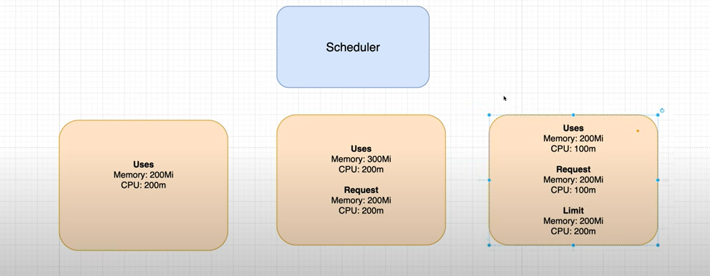

## Understanding YAML file:

- `apiVersion`:
  - apiVersion is like a folder, only the resources within which can be accessed
  - 
- `kind`:
  - resource type
- `metadata`:
  - can provide any meta data about the resource we are creating.
  - `name`:
    - Reource gets created by this name
  - `labels`:
    - Can be anything. Label will be used as reference for other resource.
- `spec`:

## Resource Type:

- Defines what kind of resource we want to create in the k8s cluster
- Types of resources:
  1. Pod
  2. Service
  3. Deployment

## Pod:

- Pod to container is generally 1:1
- `kubectl get all`
- `kubectl get pods`

## Services:

- Services bind requests to Pod running in worker node.
- `kuebectl get services`
- 4 types of services:

  1. NodePort:

     - Used to expose internal service to external world.
     - Has range from `30000-32767`
     - Typically not used by production system due to higher port range.
     - 

  2. ClusterIP

     - For internal pod communcation, it is used.
     - This is the default service type.
     - Client makes use of DNS service to call the server.
     - DNS service has service -> IP mapping.
     - 

  3. LoadBalancer

     - Alternate to the NodPort service for production environments
     - If we are exposing many services to outer world, having a load balancer for each pod is not feasible.
     - 

  4. ## Ingress
     - 

## Deployments:

- Use cases:
  1. Recreate failed pods automatically
  2. Scale out / in pods based on load
- Deployment creates replicaset which helps with re-creation of pods incase of any failure.

## DNS service:

## Namespaces:

- Think of it as folders that allow us to organize all our resources.
- `kubectl get namespaces`
- `default` name space is used if not mentioned explicitly.

## Persistent Storage:

- For database / storages, if we store it on the container, on container restart / restage, the data gets wiped out.
- Alternate is to have a Volume created in POD, which is better than above, but still having the risk of data loss incase of POD crashing.
- The best way to persist data is to use `Persistent Volume`, which protects data in case of POD / Container failures.
- To create the persistent volume, we need to create `Persistent Volume Claim`.
- Persistent Volume Claims are just options, not actual volumes Kubernetes based on pvc, creates volume.
- 
- 
- <b>Storage class</b> is where the volume gets created. It can be `hostpath` in case of `local machine`, or `EBS` for `AWS` and so on.

## Secrets & Environment Variables:

- Secrets provide an extra layer of safety.
- We can put the secrets to its own spec file and refer the key from the deployment yaml file.
- If someone has access to k8s cluster, the secret stored here are not actually safe, just that it adds a layer of safety.

## Requests & Limits:

- Each worker node in k8s cluster has limited amount of resources (i.e. memory, CPU)
- A scheduler, when gets request to create Pod, it doesn't know if the memory & CPU for the Pod meets node's capacity. This creates a bit of churn in case the pod is scheduled in the node that doesn't have enough resource. In this case scheduler evicts the pod and requests another node to create the pod.
- `Requests` are the explicitly written in pod spec so that scheduler can schedule to create pod in specific node that meets the resource requirement. Requests are just the estimates, it doesn't guarantee the resource usages by pod.
  - 
- `Limit` is the guaranted resource usage by a pod written in the spec. Pod can't exceed the limit provided in the spec.
- Providing `Requests` & `Limit` is the best thing for scheduler to make a decision.
  - 
- QoS [Quality of Service] class:
  - Based on the requests and limit details provided, kubernetes assigns the pods a specific QoS class.
  - In case of `eviction` scenario, `BestEffort` pods are `evicted first`. In case of `assignment`, `Guaranteed` pods are given the `highest priority`.
  - `Burstable` pods are better than `BestEffort` pods and worse than `Guaranteed` pods.
  - 

## Commands:

1. Delete all resources: `kubectl delete all --all`
2. Apply changes: `kubectl apply -f <<file_name>>.yaml`
3. Apply all files: `kubectl apply -f .`
4. Delete resources:
   - `kubectl delete pod/<<pod>>`
   - `kubectl delete services/<<service>>`
   - `kubectl delete deployment/<<deployment>>`
   - `kubectl delete `
5. Get Resources:
   - Get all resources: `kubectl get all`
   - Get Pods: `kubectl get pods`
   - Get Persistent Volumes: `kubectl get pv`
   - Get Persistent Volume Claim: `kubectl get pvc`
6. Check Logs:
   - `kubectl logs <<resource>> <<resource_name>>`
7. Describe Resources:
   - `kubectl describe <<resource>> <<resource_name>>`

## References:

- [Kubernetes Crash Course - Laith Academy](https://www.youtube.com/watch?v=llf65JSPmDY)
